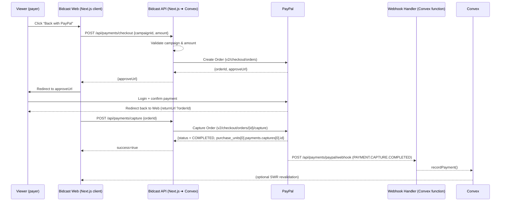

# PayPal One-Time Payment Integration — Product Requirements Document (PRD)

**Document status**: Draft — v0.1 (Aug 2 2025)

---

## 1. Objectives

The goal is to enable authenticated Bidcast creators to collect **one-time payments** from viewers / backers using their PayPal personal/business accounts, with minimal friction and full traceability in our Crowdfunding Engine (Convex backend).  
Success criteria:
- Viewer can complete a PayPal checkout from a Bidcast campaign page in ≤ 3 clicks.
- Creator sees the pledge marked *paid* in the Bidcast dashboard within < 10 s of PayPal confirmation (via webhook).
- 99.8 % of successful PayPal transactions are recorded in Convex with the correct *PayPal transaction ID*, *amount*, *currency*, and *payer e-mail*.
- No cardholder data is ever stored on Bidcast servers (PCI-SAQ A compliance).

## 2. End-to-End User Flow



### Screens / States
1. Campaign page with *Back with PayPal* button.
2. PayPal hosted approval page (wallet/select payment method, confirm).
3. Bidcast *Thank you* page with pledge summary.
4. Creator dashboard shows pledge status = *Paid*.

## 3. PayPal API Contract

### 3.1 Environment
- **Sandbox**: `https://api-m.sandbox.paypal.com`
- **Live**: `https://api-m.paypal.com`

### 3.2 Authentication
- OAuth 2.0 *Client Credentials* grant.
- Token endpoint: `POST /v1/oauth2/token`  
  `Authorization: Basic base64(<client_id>:<secret>)`  
  Body `grant_type=client_credentials` (URL-encoded)
- Response
```json
{
  "access_token": "A21AAK...",
  "expires_in": 32400,
  "token_type": "Bearer"
}
```
- Tokens cached server-side for their 9 h lifetime (refresh when <30 min left).

### 3.3 Create Order
```
POST /v2/checkout/orders
Authorization: Bearer {{access_token}}
Content-Type: application/json
PayPal-Request-Id: {{uuidv4}}   # idempotency key
```
Request body (Bidcast specific):
```json
{
  "intent": "CAPTURE",
  "purchase_units": [
    {
      "reference_id": "{{campaignId}}",
      "amount": { "currency_code": "USD", "value": "{{amount}}" }
    }
  ],
  "application_context": {
    "return_url": "https://bidcast.app/paypal/return",
    "cancel_url": "https://bidcast.app/paypal/cancel"
  }
}
```
Relevant response fragment:
```json
{
  "id": "5O190127TN364715T",
  "status": "CREATED",
  "links": [
    { "rel": "approve", "href": "https://www.sandbox.paypal.com/checkoutnow?token=5O190..." }
  ]
}
```

### 3.4 Capture Order
```
POST /v2/checkout/orders/{orderId}/capture
Authorization: Bearer {{access_token}}
Content-Type: application/json
PayPal-Request-Id: {{uuidv4}}
```
Success (HTTP 201):
```json
{
  "id": "5O190127TN364715T",
  "status": "COMPLETED",
  "purchase_units": [
    {
      "reference_id": "CAM-abc123",
      "payments": {
        "captures": [
          {
            "id": "3C6795508Y346546M",
            "status": "COMPLETED",
            "amount": { "currency_code": "USD", "value": "25.00" },
            "seller_protection": { "status": "ELIGIBLE" },
            "create_time": "2025-08-02T11:02:00Z"
          }
        ]
      }
    }
  ]
}
```

### 3.5 Webhooks
- Endpoint: `POST https://api.bidcast.app/api/payments/paypal/webhook`
- Events to subscribe:
  - `PAYMENT.CAPTURE.COMPLETED`
  - `PAYMENT.CAPTURE.DENIED`
  - `PAYMENT.CAPTURE.REFUNDED`
- PayPal signs the payload using `Transmission-Sig` + `cert_url`; validate with the SDK.

Webhook JSON (abbreviated `COMPLETED`):
```json
{
  "event_type": "PAYMENT.CAPTURE.COMPLETED",
  "resource": {
    "id": "3C6795508Y346546M",
    "status": "COMPLETED",
    "amount": { "currency_code": "USD", "value": "25.00" },
    "custom_id": "CAM-abc123"
  }
}
```

## 4. Error Handling Strategy

| Scenario | Detection | Bidcast Response | User Feedback |
|----------|-----------|------------------|---------------|
| Network timeout (<30s) on *create* | Axios timeout | Retry *create* once, else show error page | “PayPal is currently unreachable — please try again.” |
| `422 UNPROCESSABLE_ENTITY` invalid amount | PayPal JSON error `issue=AMOUNT_INVALID` | Log & surface validation error | “Please enter a valid amount” |
| Payer cancels at PayPal | return on cancel URL | Mark pledge as `cancelled` | Modal: “Payment cancelled” |
| Payment declined (webhook `DENIED`) | Webhook handler | Update pledge `failed` | Email to viewer with retry link |
| Webhook not received (within 2 min) | Cron job scans *pending captures* | Poll Capture API, reconcile | N/A |

All errors are logged via Vercel / Next.js logger + Sentry (future). Convex mutation `recordPayment` marked idempotent by PayPal `capture.id`.

## 5. Security Considerations
- **Credential storage**: `PAYPAL_CLIENT_ID` & `PAYPAL_SECRET` stored in Vercel encrypted env vars; read only by server components.
- **PCI-SAQ A**: Bidcast never touches card data; PayPal hosts checkout.
- **CSRF / Redirect**:
  - `state` param bundled in `return_url` to match session.
  - POST routes protected by Clerk JWT & CSRF double-submit cookie.
- **Webhook verification**: Use PayPal Node SDK `verify()` to check signature and certificates.
- **Idempotency**: `PayPal-Request-Id` prevents duplicate orders; Convex mutations check `captureId` uniqueness.
- **Input validation**: zod schemas on amount (positive, ≤1000 USD) and campaign existence.

## 6. Testing Plan

### 6.1 Unit Tests (Vitest)
- `@/lib/paypal/client.ts`
  - `createOrder()` returns approve URL when PayPal SDK stub responds 201.
  - `captureOrder()` parses `capture.id` & amount.
  - Throws mapped `PaymentError` subclasses on 4xx/5xx.
- Mock with `msw` + fixtures from §3.

### 6.2 Integration Tests (Sandbox)
- GitHub Actions job `paypal-sandbox-test.yml` (manual trigger) runs:
  1. `npm run test:sandbox` which
     - calls live Sandbox API to create & capture a $1.00 order using test buyer account.
     - asserts webhook received within 30 s using Convex live query.
- Requires secrets `PAYPAL_SANDBOX_CLIENT_ID/SECRET` in repo variables *with no write scope*.

### 6.3 CI Mocking Guidelines
- Default CI flows (PRs) stub PayPal HTTP calls via `nock` to avoid external traffic.
- Fixture response bodies stored under `tests/fixtures/paypal/*`.  Ensure IDs look realistic to catch string parsing bugs.
- Disable Vitest’s network if `CI=true` to enforce mocks.

---

## 7. Open Questions / Next Steps
1. Should we support non-USD currencies at MVP? (PayPal supports multi-currency but UI needs work.)
2. Refund flow — will creators initiate refunds via PayPal dashboard or need UI inside Bidcast?
3. Finalise success email template (copy & design).

---

© 2025 Bidcast
